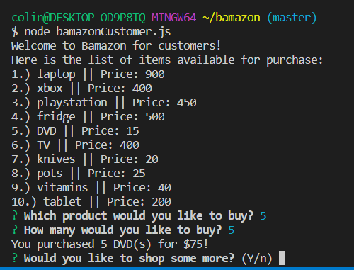
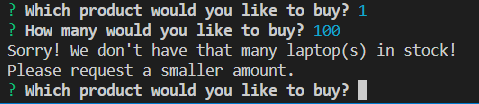
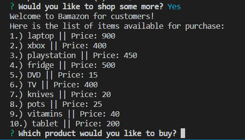
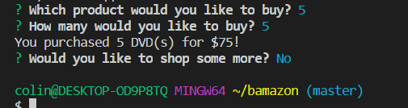

# bamazon

## This app contains 3 unique functions:

* Customer View
* Manager View
* Supervisor View

### Customer View

The user will be show a list of items available for sale and asked what they would like to purchase and how much of that item they want.

If the user asks for more that was is currently held in stock, the user will be asked to request a smaller amount;

The program will continue once a valid selection has been entered;

